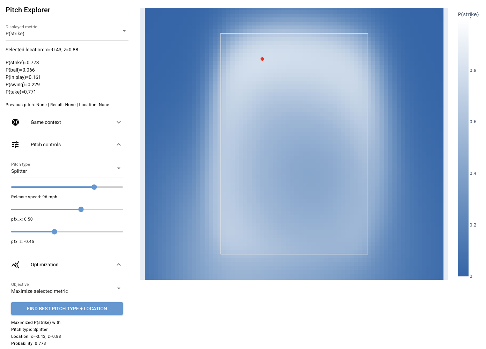
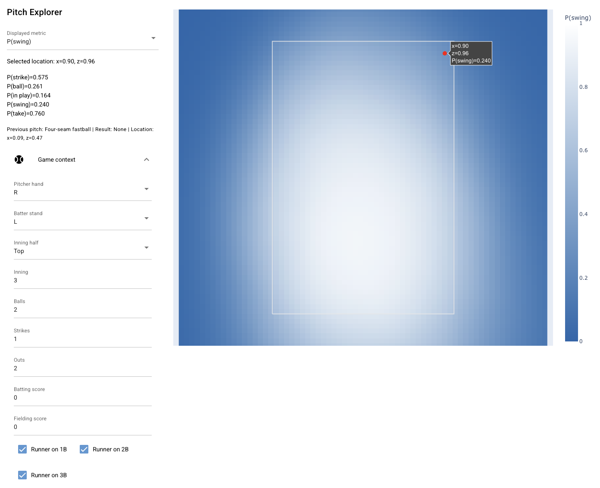

# pitch explorer

Pitch Explorer is a tool for viewing the probabilities of different pitch outcomes given pitch characteristics, pitcher/batter characteristics, game context, etc.

## examples

You can explore questions like:

- Given a leftie pitching 96 mph at a rightie, what pitch type/location is most likely to result in a strike?

- What is the probability that a leftie batter will swing at an 81 mph splitter in the top right corner from a rightie pitcher in the top of the third inning on a 2-1 count with the bases loaded and two outs?

## usage

1. Clone this repository.
2. Run `pip install -r requirements.txt` to install the dependencies.
3. Run `python get_bsx_data.py` and `python get_swing_data.py` to build the datasets.
4. Run `python train_bsx_model.py` and `python train_swing_model.py` to train the models.
5. Run `python gui.py` to start the GUI.

## notes

- The models are trained on data from the 2024 and 2025 regular seasons.
- They can definitely be improved!! And if you do improve them, it shouldn't be too hard to update the GUI accordingly.
- Feel free to send a PR/email me/etc.
